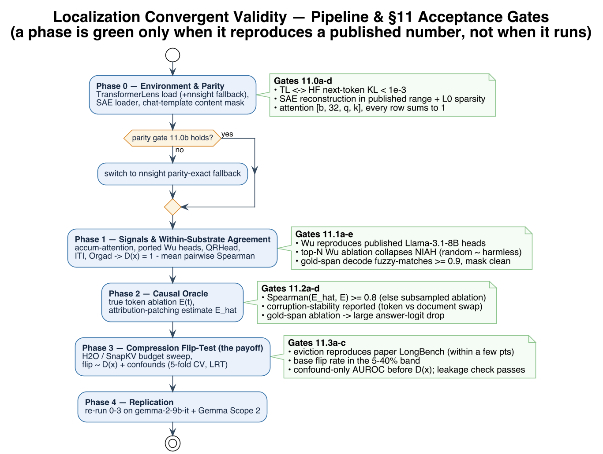
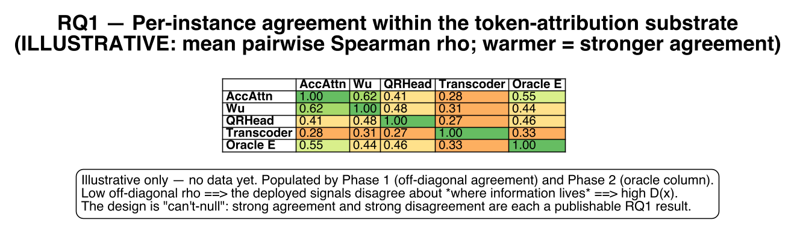
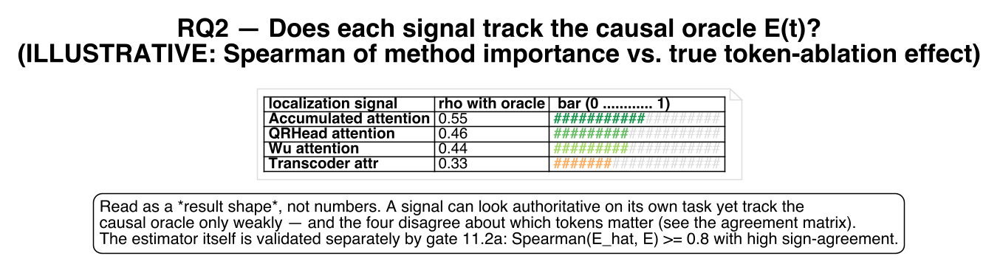
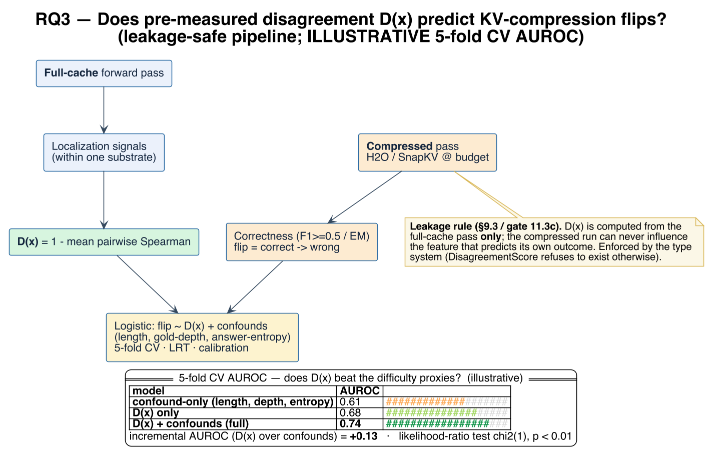
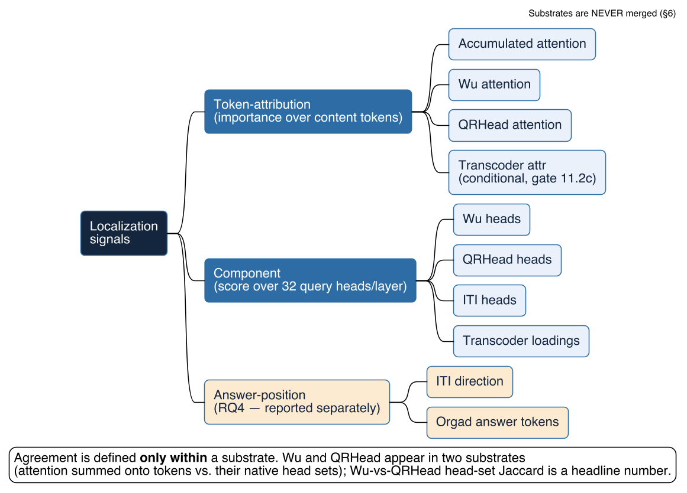

# Localization Convergent Validity

> Do the localization signals we deploy in LLM inference agree per-instance on *where information lives*, does each track a causal oracle, and does their **disagreement predict KV-compression failure**?

**Type:** Application (research pipeline — deep rigor)
**Stack:** Python 3.10+ · PyTorch 2.1+ · TransformerLens (primary) + SAELens · nnsight (fallback) · KVPress · scipy/sklearn/statsmodels
**Compute:** single 80GB H100, rented via SF Compute
**Skill Loadout:** PAUL (Phase 0–4 → milestones; §11 acceptance tests → milestone exit criteria)
**Quality Gates:** the §11 acceptance tests — parity (11.0), signal reproduction (11.1), oracle validation (11.2), flip-test integrity (11.3), replication (11.4)

> **Binding contract:** `docs/localization-convergent-validity-spec (1).md` (science) and `docs/localization-convergent-validity-engineering-addendum.md` (engineering). "§N" references point at the addendum, the authoritative implementation spec. Full ideation plan: `~/projects/localization-convergent-validity/PLANNING.md`.

---

## Overview

A family of inference methods is justified by a claim of the form *"the information for this task lives at component/token X"*: KV eviction keeps heavy-hitter tokens, head-aware compression keeps retrieval heads, SAE/probe detectors read truth from specific positions. Each is validated against its own task; almost none against each other.

This harness asks, **per instance**: (1) do these signals **agree**, (2) does each track a **per-instance causal oracle**, and (3) — the payoff — does pre-measured cross-method **disagreement `D(x)` predict that H2O/SnapKV will flip a correct answer to wrong**, beyond trivial difficulty proxies (length, depth, confidence).

It differs from MIB/BlackboxNLP in one breath: **per-instance, not aggregate; deployed inference objects, not stylized circuits; disagreement-forecasts-failure, not method-ranking.** The design is "can't-null" — every agreement outcome is publishable, and the fragility result is an independent payoff.

---

## Pipeline & Expected Results

> **Illustrative schematics** rendered with PlantUML (sources in [`docs/diagrams/`](docs/diagrams)). **No experiments have run yet** — these show the *shape* of each gate's output so a reviewer can see what Phase 0–4 will produce. **All numbers are placeholders, not findings.** Regenerate with `plantuml -tpng docs/diagrams/*.puml`.

**Methodology — Phase 0 → 4 and the §11 acceptance gates.** A phase is green only when it reproduces a published number, not when it runs.



**RQ1 — Do the deployed signals agree per-instance?** Within-substrate pairwise Spearman; low off-diagonal correlation means the tools disagree about *where information lives* → high `D(x)`.



**RQ2 — Does each signal track the causal oracle `E(t)`?** A signal can look authoritative on its own task yet correlate only weakly with the true token-ablation effect — this is what decides the headline.



**RQ3 — The payoff.** Does pre-measured disagreement `D(x)` predict KV-compression flips *beyond* trivial difficulty proxies? The pipeline is leakage-safe by construction: `D(x)` comes from the full-cache pass only.



**Substrate structure.** Agreement is computed *only within* a substrate; substrates are never merged (§6).



---

## Stack

| Layer | Choice | Rationale |
|-------|--------|-----------|
| Instrumentation (primary) | TransformerLens `HookedTransformer` ≥2.0 | String hook points, turnkey patching, SAELens loads Llama Scope onto its hooks |
| Instrumentation (fallback) | nnsight + HF | Numerical parity by construction; used only if parity gate 11.0b fails |
| SAE / transcoder | SAELens + Llama Scope (`fnlp`/`OpenMOSS-Team`) | Transcoders (`LXTC`) per sublayer, built for clean attribution |
| KV compression | KVPress (NVIDIA) | Maintained H2O/SnapKV under HF generate; hand-rolled eviction is where silent bugs live |
| Stats | scipy, scikit-learn, statsmodels | Agreement metrics + logistic flip model, LRT, CV |
| Models | `meta-llama/Llama-3.1-8B-Instruct` (primary), `google/gemma-2-9b-it` (replication) | Retrieval-head/KV lineages use Llama; Gemma Scope 2 for non-Llama replication |
| Env | uv lockfile (pinned, hashed) | Reproducibility across ephemeral rented nodes |

**Prime directive (§0):** treat every library name as a *starting point to verify against the current ecosystem* — the reproduce-a-published-number gates (§11) are what guarantee correctness. Do **not** pip-install `nightdessert/Retrieval_Head` (pins transformers 4.37.2, can't load Llama-3.1) — **port** the algorithm (§5.2).

---

## Architecture

Module layout (addendum §12). Human review happens at module boundaries; if the contracts hold, downstream stats are mechanical.

```
model/        backbone (TL load + nnsight fallback), chat_template (content-token mask), sae_loader
signals/      attention_hh, retrieval_wu, retrieval_qr, transcoder_attr, iti_heads, orgad_tokens
substrates.py projections + per-instance normalization (§6)
agreement.py  Spearman / Jaccard / RBO / D(x) / permutation + BH-FDR (§7)
oracle/       ablation (true E), attr_patching (E_hat + gate), corruption (token/document swap)
compression/  flip_test (KVPress + reproduce-paper gate), correctness (EM/F1), flip_model (logistic + LRT + CV)
data/         niah, hotpotqa, longbench, triviaqa (loaders + gold-span→token mapping)
tests/        phase0.py … phase4.py  (the §11 gates, runnable)
analysis/     figures (agreement heatmaps, fidelity distributions, flip ROC)
env/          uv lockfile, model + SAE download scripts
```

### Module Contracts
- **token-signal** → normalized importance vector over content tokens (shared content-token mask)
- **component-signal** → score over query heads (32/layer)
- **oracle** → per-token causal effect `E` (+ attribution-patch estimate `E_hat`)

---

## Data Model

| Entity | Key Fields | Relationships |
|--------|-----------|---------------|
| Instance | rendered_prompt, context_tokens, content_token_mask, gold_span, answer_string, dataset | has many signals; one oracle effect; flip records per (method,budget) |
| ImportanceVector | method, normalized vec over content tokens, substrate=token-attr | belongs to Instance |
| HeadScore | method, score over query heads, substrate=component | global or per-instance |
| Substrate | name ∈ {token-attribution, component, answer-position}, members | agreement only within a substrate |
| OracleEffect | E[token], E_hat, granularity ∈ {token, sentence/span} | belongs to Instance |
| DisagreementScore | D(x) = 1 − mean pairwise Spearman (within substrate) | full-cache run **only** (leakage rule) |
| FlipRecord | method ∈ {H2O, SnapKV}, budget, correct_full, correct_compressed, flipped | Phase-3 label |
| RetrievalHeadSet | source ∈ {Wu, QRHead}, head_ids, scores | Wu-vs-QRHead disagreement = headline number |

Substrates are **never merged**; ITI/Orgad live in the answer-position substrate (RQ4), reported separately; ITI also contributes its head set to the component substrate.

---

## Execution & Reproducibility

- **Local (CPU):** all plumbing, masking, metrics, unit tests — no model required.
- **Rented H100 (SF Compute):** block-rent per phase → run §11 gates + sweeps → release. uv lockfile + `env/` download scripts make each clean node reproducible. SAE checkpoints ≈ low tens of GB (re-downloadable); activation caching on-the-fly (no large persistent volume).
- **Cost mitigations (§8.4):** 1K–4K context core; sentence/span-granularity oracle where gold is sentence-level; attribution patching for the full sweep with subsample verification. Single-GPU footing throughout.

---

## Scientific-Validity Gates

The failure mode is **not a crash** — it's clean-but-wrong code. Each threat is paired with the gate that catches it.

| Threat | Mitigation | Gate |
|--------|-----------|------|
| Leakage (D(x) sees the compressed run) | D(x) from full-cache pass only; structurally isolated | 11.3c |
| Silent mis-wiring (wrong hook / token set) | Reproduce published numbers, not "it ran" | 11.0c, 11.1a |
| Chat-template off-by-one | Explicit content-token mask from tokenizer offsets; decode to verify | 11.1e |
| Oracle arbitrariness | Fixed/reported corruption (token-swap, never Gaussian); stability across two corruptions | 11.2b |
| Attribution-patch infidelity | Spearman(E_hat, E) ≥ 0.8 or fall back to true ablation | 11.2a |
| Lossy SAE dictionary | Report answer-relevant captured variance | §4.4 |
| Attention-output SAEs (`LXA`) | Forbidden — authors' dead-feature warning | §4.2 |

---

## Implementation Phases

Agent builds; **human signs off at each phase boundary**. A phase is green only when the instrumentation is *provably* correct, not when it runs.

### Phase 0 — Environment & Parity
Build: uv env, TL load (+nnsight fallback), SAE loader, chat-template content-mask, download scripts.
Gates (§11.0): coherence · TL↔HF KL < 1e-3 · SAE reconstruction in published range + L0 sparsity · attention `[b,32,q,k]`, rows sum to 1.
Outcome: trustworthy instrumentation.

### Phase 1 — Signals & Within-Substrate Agreement (can't-null core)
Build: accumulated-attention, ported Wu heads, QRHead, ITI heads, Orgad tokens, substrates, agreement metrics + D(x), gold-span mapping.
Gates (§11.1): Wu reproduces published heads · top-N Wu ablation collapses NIAH vs random · top-32 QRHead ≥ top-32 Wu · accumulated-attn ranks needle > random · gold-span decode ≥0.9, mask clean.
Outcome: agreement matrices + gold-span precision (RQ1); Wu-vs-QRHead disagreement.

### Phase 2 — Causal Oracle (decides the headline)
Build: true ablation E(t), attribution-patching E_hat + gate, corruption module, method-vs-oracle fidelity.
Gates (§11.2): Spearman(E_hat,E) ≥ 0.8 · corruption stability · transcoder gate (gold AUROC>chance & oracle-Spearman>~0.3, else drop to component substrate as a finding) · gold-span ablation → large logit drop.
Outcome: outcome classification — noisy tools / plural localization / method ranking (RQ2).

### Phase 3 — Compression Flip-Test (the payoff)
Build: KVPress H2O+SnapKV budget sweep, pre-registered correctness (F1≥0.5 primary, EM robustness), logistic `flip ~ D(x)` vs `+confounds`, 5-fold CV, LRT, calibration; leakage-safe pipeline.
Gates (§11.3): compression reproduces paper LongBench within a few pts · flip rate in 5–40% band · confound-only AUROC reported before D(x), leakage check passes.
Outcome: does D(x) add signal beyond difficulty proxies → training-free compression-fragility flag (RQ3).

### Phase 4 — Replication
Re-run Phase 0–3 on `gemma-2-9b-it` + Gemma Scope 2. Replicates or not — either is reportable.

---

## Design Decisions

1. **TransformerLens primary, nnsight fallback** — unambiguous hooks + turnkey patching; drift closed by 11.0b.
2. **Instruct model + base-trained SAEs + captured-variance control** — deployment realism is the point; variance control guards interpretation.
3. **Transcoders over residual SAEs** (`8x`/32K default) — built for clean attribution.
4. **Attention-output SAEs (`LXA`) excluded** — authors' dead-feature warning.
5. **Wu *and* QRHead both included** — converts a live scientific fork into a headline disagreement measurement.
6. **Token ablation as oracle** — same operation as KV eviction, so the oracle measures what the flip test stresses.
7. **Token-level eviction (H2O, SnapKV)** — sidesteps the GQA query/KV-head granularity issue; head-level (DuoAttention) deferred.
8. **Deterministic correctness metric** (no LLM judge in core) — reproducibility.
9. **Corruption = symmetric token-swap** (never Gaussian) — stable, semantically controlled.
10. **Transcoder layers 8/16/21** (~25/50/65% depth).
11. **Single 80GB H100 via SF Compute**; reproducibility via lockfile + download scripts.
12. **Full Phase 0–4 scope** including Gemma replication.
13. **Substrates never merged**; cross-family comparisons (attention vs transcoder vs oracle) are load-bearing; ITI/Orgad reported separately (RQ4).

---

## Open Questions

1. SF Compute single-node SKU + live H100 pricing (verify before booking).
2. Parity fallback to nnsight if 11.0b fails (§13.1).
3. Drop transcoder token substrate if gate 11.2c fails — **report as a finding** (§13.6).
4. Flip-test budget points tuned to the 5–40% band (§13.7).
5. Probing datasets: ITI needs a labeled true/false set distinct from QA evals; QRHead needs a few real long-context QA examples.
6. Gemma-2-9B architecture facts + Gemma Scope 2 hook points (Phase 4).

---

## References

Hase et al. 2301.04213 · Kantamneni et al. 2502.16681 · MIB 2504.13151 · Wu retrieval heads 2404.15574 · QRHead 2506.09944 · H2O 2306.14048 · SnapKV · ITI 2306.03341 · Orgad et al. 2410.02707 · Llama Scope 2410.20526 · Zhang & Nanda 2309.16042 · Syed et al. attribution patching.
